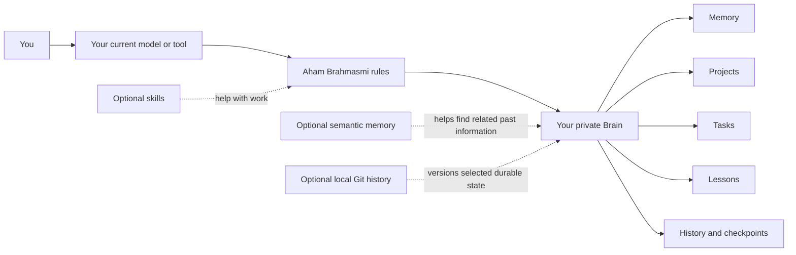
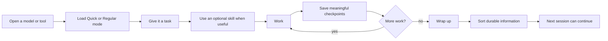
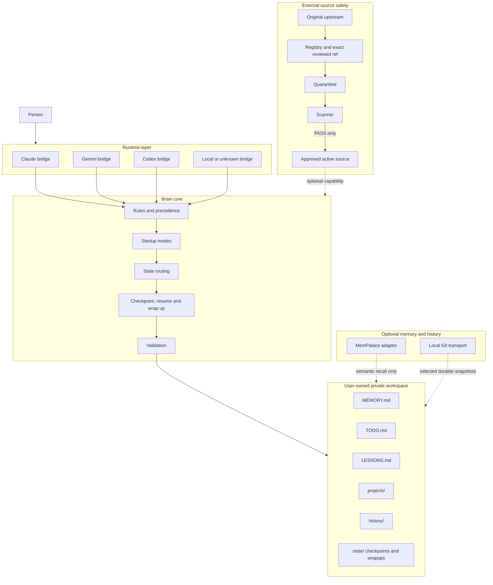

# How Aham Brahmasmi fits together

This page shows the same project at two levels. The first view is for someone who only wants to understand what happens. The second view is for someone who wants to inspect how the pieces are separated.

## The simple view

The important part is that the box on the left can change. Claude, Gemini, Codex, a local model, or a future tool can all use the same private Brain when they can follow the framework's instructions.

The private Brain belongs to the user. The model, skill collection, memory service and Git host do not own it.

## What using it feels like

If a session crashes after a checkpoint, the next session verifies that checkpoint and resumes from the last completed milestone instead of inventing what might have happened.

## The technical view

## Separation rules

The public project contains the framework only. Personal memory, private projects, machine-specific notes, credentials and private infrastructure belong outside it in the user's private workspace.

Runtime bridges translate the same core lifecycle into the instruction mechanism available to the current tool. A runtime name never grants permissions or capabilities by itself.

Skills and other third-party sources keep their original ownership and licenses. Installable sources are fetched from their original upstream at the exact reviewed commit, staged in quarantine, scanned, and activated only after a `PASS` result.

Local workspace files are the required durable state. MemPalace can improve semantic recall, and Git can add version history, but neither is required for the Brain to start or preserve its basic state.

## Design principle

Your tools may change. Your memory, skills, projects and progress should not.

Everything important belongs to the user, not to one model or one harness.
